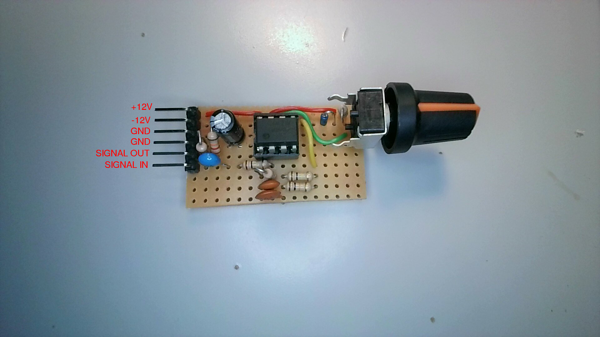

# Fuzz Effect

The fuzz effect produces a strongly overdriven signal of constant amplitude. It sounds terrible when playing chords, but for single note lines or powerchords it can be suitable.

## Original circuit

The original circuit was published in "Electronic Projects for Musicians" by Craig Anderton under the name "ULTRA-FUZZ" (Project No. 6):

## Simulation

Below is a simulation of the circuit, using the Falstad circuitjs simulator. I've omitted D1, D2, C4 and C5, since they only serve as reverse-voltage protection and decoupling of the supply rails respectively.

<iframe width="750" height="600" src="https://falstad.com/circuit/circuitjs.html?running=false&ctz=CQAgjCAMB0l3BWEAmaYAcBmMkFgCwYBsyk6+RICkVI+mVApgLRhgBQ+kAnCN5WADslZMnzhh4KNErN00boQSYE6dAm7Iw1BjEjJsUTjyqaUXEINLmaEGLKELlq5IMxb0bouL0G77AGMQd3AiGlYBMKgUaGQWQWl4TG5BbjJIfHRubgQSbkwEvUgOACdg5FCafkronHhIdjLq7xQxEBbberhA1vEwSmr+6PxoQRY2aQR8fnxcogRkaiIVXiKOIOQ1CRE2oUpbWC6j+DB4kGY9bgJkTSIrheL8V0Ti9gB3Pkiqyg73z-bxIN9n9RH1JKCAUYPhCWhChg0AOb-MBmaqkdDRBoAJRqBD6UTYFRoNAsq0x0AQ7Bx-Ro6JqYmJw3CZOJFMaKC2ew5GMW+3A9XZmx5uW5wUwfLq8HYSKFYpEWxURKhot5wXIKBFDQ+Ggqqsw6tVDQAbucuTTTeCLLZ+XBEkhGTBKUjWJbwlzXEqtaavhafQ0APIgdC22VqWlbYnsUi8Ky0iyCA1Wl5wOyxTD6DJ3ZBEMLzbz7Q4QDhCcQJ8QMyzqzDiqSS1lILGMADOAEsmwAXACGADsAoxpZXxNXKGXggtMewAB7tCrMAwahJzknmfkAEwAQgAdJsIzst7vbjudhH9nH4TLekkX1hmRmkzGTKl0C8hc8YjpM84sx9I8UY5gtH+5wXpGq50EMrBgBUhCyLCICrowABmnYAK4ADbtuwYEwecLQ4REKDwUhqEYX8+FDG+3rKkBAHiPhvwfORUHPv+hJGCWLGmsxlEEUW9STCAjatkevb9oxLS0VQmy4T4fwLP+LTyb0ypKRCOrKQ007YOIc6EO045zvqdDgBiADKjDdq27YtkaLbtgAntuAQAPbdu2JTOWh24ABQAI3bq5jDbquLbOQhwUeQADgAlFOVCqOAUyWCkiUJOW4gAEQAMLOQAtpFnYlJ27bOSUGWHl2J5PnmKBkPpAiSHeVQPo61Uih69XBBkD4WMw36tWUPEUS+Sp1uyQ1RENzGdFKgaylyQFcpGzngLwGI0JO6iELoMiLMmPDCLke20tIdircE+3TNk103bdwIrbMQbRJtUxgAw9poLWUgNCtohPbY4ookgH0QBUHBAA"></iframe>

## How it works

The first op-amp stage is a regular inverting amplifier stage, with a gain of 10.

The amplified output is fed into the second op-amp stage. In this stage the op-amp acts as a comparator, since no feedback is provided.
It compares the amplified signal with a reference voltage provided by the sensivity-control circuitry.

While the signal remains below that voltage, the op-amp is saturated towards one of the rails. As soon as the amplified signal crosses the sensitivity threshold though, the op-amp rapidly switches back and forth, whenever the signal swings past the threshold point.

## My build

### Modifications to the circuit

After some experimentation, I've modified the sensitivity control in two ways:
1. Omit the bottom diode and 10k resistor, instead tie the bottom of the pot to GND. In the original circuit both halfs of the pot basically do the same thing, with the highest sensitivity at the center of the pot. With this modification the entire range of the pot is usable, tuning between almost 0V and the full drop of the diode.
2. Use a schottky diode (1n5711) instead of 1n4001, for it's lower voltage drop. This way almost the whole sensitivity range is usable when driven directly from my guitar. If driven from some amplified stage, this may be undesirable though.

The resulting sensitivity circuit looks like this:

I'm also using a fixed divider (22k/1.5k) at the output, instead of a volume pot (which I already regret, so it may change).

### Pictures

Top

Bottom

